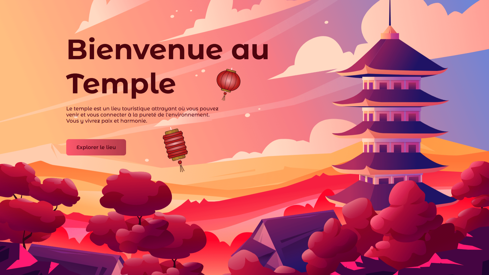

<div align="center"> 
  <a href="https://background-animation-temple.netlify.app/" target="_blank"> 
     
  </a> 
  </br></br> 
  <h3 align="center">🏯 Background Animation - Temple</h3> 
</div>

## <br /> 📌 Sommaire

&nbsp;&nbsp;&nbsp; 🎨 &nbsp; [**Introduction**](#introduction)<br />
&nbsp;&nbsp;&nbsp; 🛠️ &nbsp; [**Technologies**](#technologies)<br />
&nbsp;&nbsp;&nbsp; 🎯 &nbsp; [**Fonctionnalités**](#fonctionnalités)<br />
&nbsp;&nbsp;&nbsp; 🚀 &nbsp; [**Installation**](#installation)<br />

## <br /> <a name="introduction">🎨 Introduction</a>

Temple est une page d’accueil immersive avec animations GSAP et effets visuels inspirés des pétales de sakura. Parfait pour des projets artistiques, spirituels ou culturels au style raffiné.

## <br /> <a name="technologies">🛠️ Technologies</a>

- HTML5 sémantique
- CSS3 avancé (media queries, animations)
- JavaScript ES6
- [GSAP](https://gsap.com/)
- [Sakura.js](https://github.com/jhammann/sakura)
- [Remix Icons](https://remixicon.com/)

## <br /> <a name="fonctionnalités">🎯 Fonctionnalités</a>

- Animation d’arrière-plan avec effets de pétales tombants
- Animation séquentielle des éléments (GSAP)
- Menu responsive avec effet mobile toggle
- Scroll avec effet flou sur le header
- Design poétique, calme et contemplatif

## <br /> <a name="installation">🚀 Installation</a>

### ✅ Prérequis

- [Google Chrome](https://www.google.com/) — Navigateur moderne
- [Visual Studio Code](https://code.visualstudio.com/) — Éditeur de code
- [Live Server](https://marketplace.visualstudio.com/items?itemName=ritwickdey.LiveServer) — Extension VS Code

### 📥 Cloner le projet

```bash
git clone https://github.com/ValentinMadiot/background-animation-temple_js
cd background-animation-temple_js
```

### ▶️ Lancer le projet

Il suffit d’ouvrir le fichier `index.html` dans un navigateur, ou d’utiliser l’extension **Live Server** pour un rendu dynamique.
